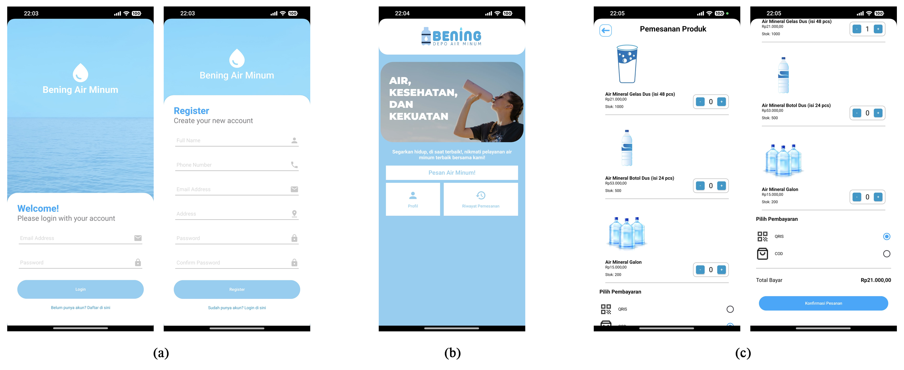
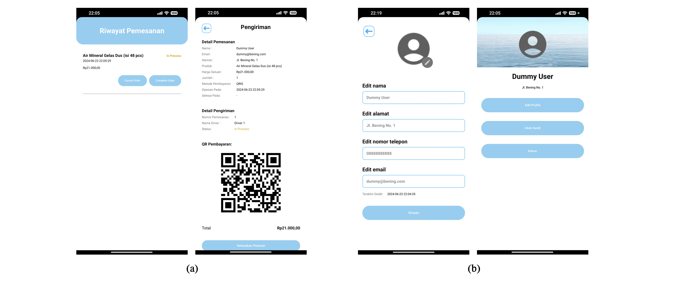

# Bening Air Minum Mobile App

Bening Air Minum is a mobile application designed to facilitate the ordering process of bottled water and other packaged water products for Bening Water Company.

## Features

- User authentication and account management
- Online ordering with payment options: online payment and Cash-on-Delivery (COD)
- View order history and status

## Installation and Usage

### Installation

You can run the application using Android Studio and an Android emulator. Alternatively, you can find the APK file in the Releases section for direct installation on Android devices.

### Usage

1. **Create Account or Login**: Start the application, where users can create a new account or log in with existing credentials.
   
2. **Place Orders**: Navigate to the main dashboard and access the ordering menu. Enter the quantity of products desired and select the preferred payment method.
   
3. **View Order Status**: Check the status of orders in the "Order History" section on the main dashboard.

### Admin Dashboard Credentials

To access the admin dashboard, use the following credentials:

- **Email**: admin1@waterdepot.com
- **Password**: admin1234

## Screenshots

## Technologies Used

- Java programming language
- Android Studio with various open-source dependencies

## Contributors

- Andreas Aji Raninda
- Nayandra Agastia Putra
- Rizky Suryasyah
- Muhammad Adi Wira Kusuma
